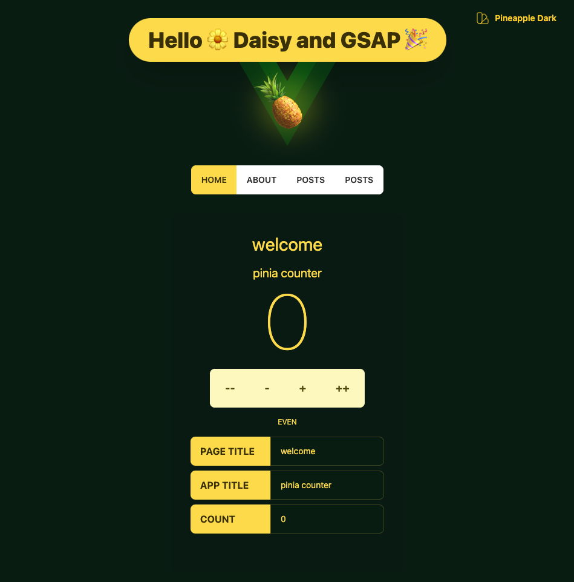
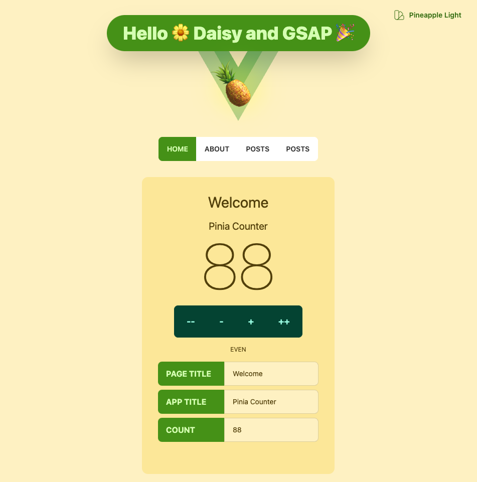
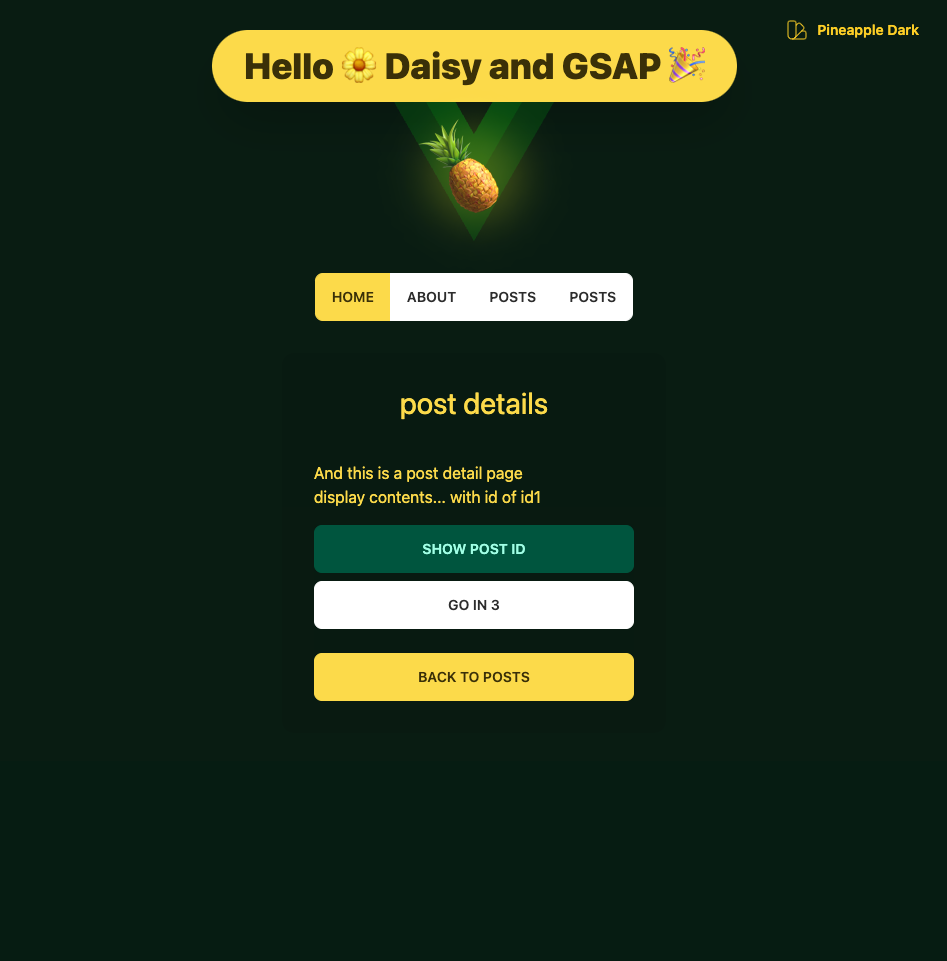
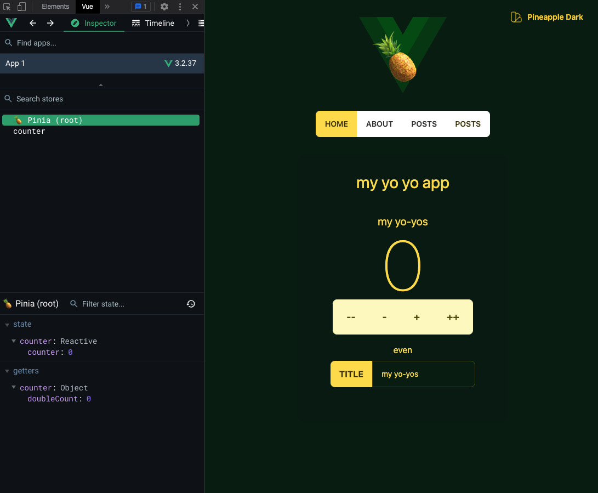
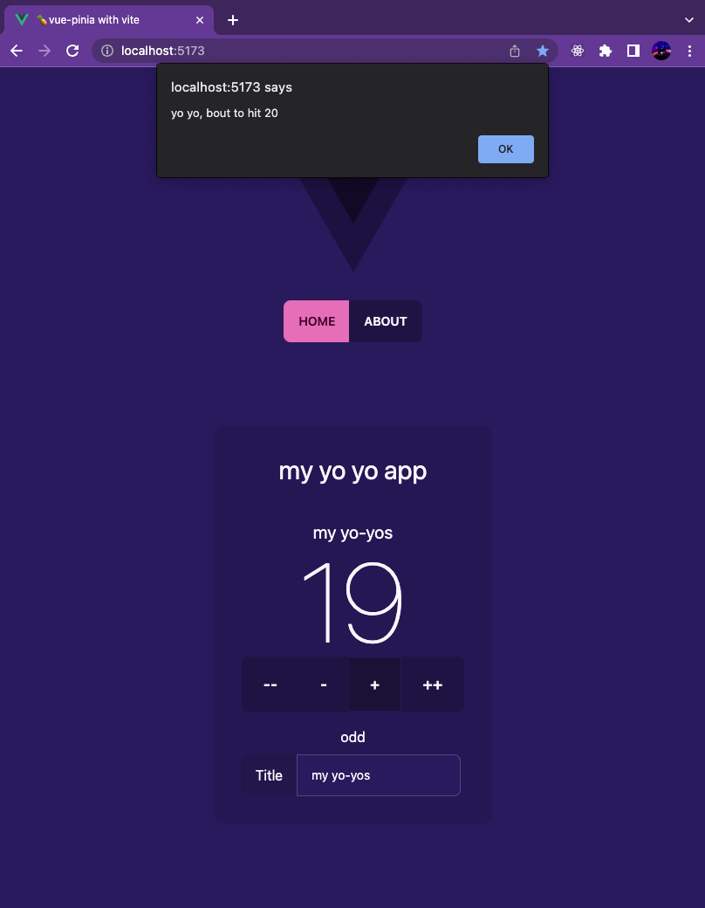
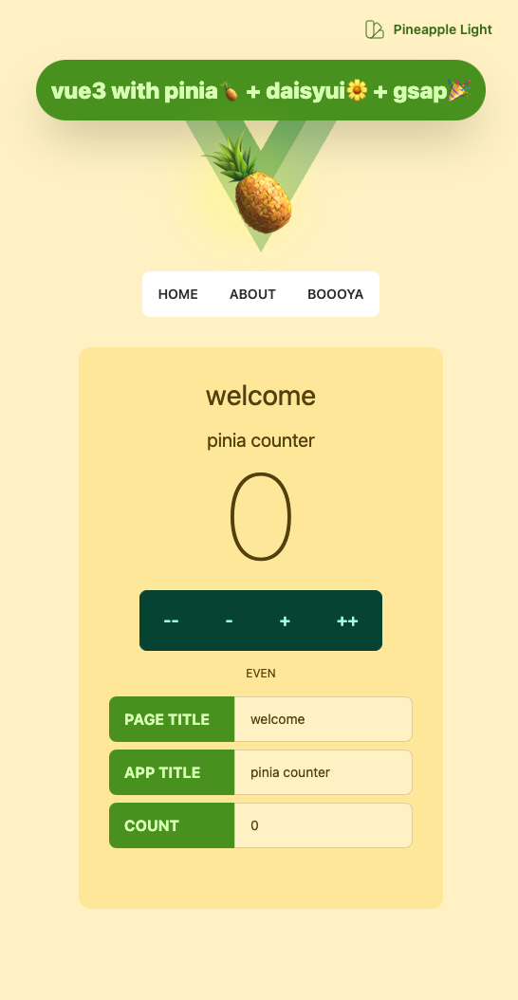
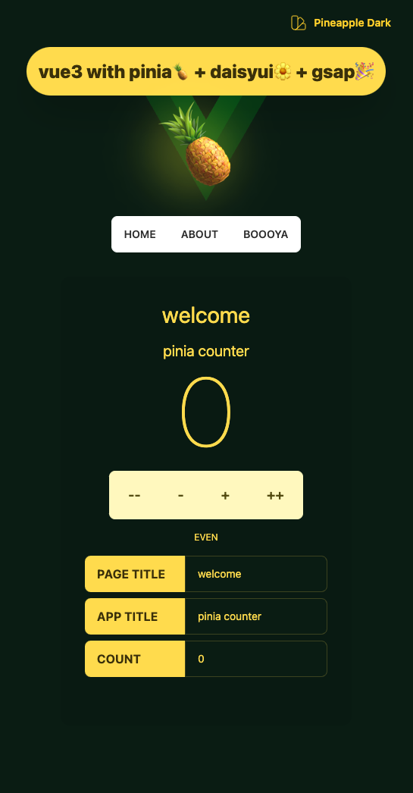

<div class='flex'>



</div>

# 🍍vue-pinia 

## vue3+pinia+tailwind+daisyui+gsap⚡️

> see the bottom of this readme for a full setup script to install all of the above in one command...

Vue 3 + Vite + Pinia + TailwindCSS

Using Vite to create a new vue project, then add pinia

```
yarn create vue-pinia
```
Following the prompts to select vue and then add tailwind
``` 
npm install -D tailwindcss postcss autoprefixer
npx tailwindcss init -p
```
Now the current tailwind config following the tailwind docs...

```javascript
/** @type {import('tailwindcss').Config} */ 
module.exports = {
  content: [
    "./index.html",
    "./src/**/*.{vue,js,ts,jsx,tsx}",
  ],
  theme: {
    extend: {},
  },
  plugins: [],
}
```
### Add pinia🍍  and daisyui🌼

```
yarn add pinia
```

Below is pinia and vue router together...

```javascript
import { createApp } from 'vue'
import { createPinia } from 'pinia'
import App from './App.vue'
import router from './router'

import './styles/tailwind.css'

const app = createApp(App)

app.use(createPinia())
app.use(router)

app.mount('#app')
```

### Fully working with pinia...

Setup and using two stores with bindings... nice...



Next.. daisyui (if theming is desired and for ui components) and gsap (for animations)

```
yarn add daisyui gsap
```

# final Note

To scaffold up a clean install with all of the magic this combination brings....

npm
```
npm install -D tailwindcss postcss autoprefixer
npm install daisyui pinia gsap
npx tailwindcss init -p
```
yarn
```
yarn add -D tailwindcss postcss autoprefixer
yarn add daisyui pinia gsap
npx tailwindcss init -p
```

> see the final package.json and tailwind.config.js for the full setup...
>> as well as a light/dark only setup for an easy darkmode setup with one color scheme in two colormodes
 tailwind.config.js
```javascript
/** @type {import('tailwindcss').Config} */
module.exports = {
  content: ["./index.html", "./src/**/*.{vue,js,ts,jsx,tsx}"],
  theme: {
    extend: {},
  },
  plugins: [require("daisyui")],
  daisyui: {
    themes: [
      {
        // started from daisy 'lemonade'
        light: {
          primary: "#519903",
          secondary: "#facc15",
          "secondary-focus": "#fcd34d",
          accent: "#ffffff",
          "accent-focus": "#d9f99d",
          neutral: "#064e3b",
          "base-100": "#fef3c7",
          info: "#C8E1E7",
          success: "#DEF29F",
          warning: "#F7E589",
          error: "#F2B6B5",
        },
      },
      {
        // started from daisy 'night', now to be named, lemonade evening...
        dark: {
          primary: "#fde047",
          secondary: "#065f46",
          accent: "#ffffff",
          "accent-focus": "#faebd7",
          neutral: "#fef9c3",
          "base-100": "#061e11",
          "base-content": "#fde047",
          info: "#0284c7",
          success: "#059669",
          warning: "#ea580c",
          error: "#be123c",
        },
      },
    ],
  },
};

```

> also, for daisyui themes, being locally loaded for easy customization of the full set of 29 daisyui themes as well as an easy way to add as many as you like...

### themes... easy! 



# and the current final version of this out of the box...



[Check out the live demo for vue-pinia](https://vue-pinia.netlify.app/)

